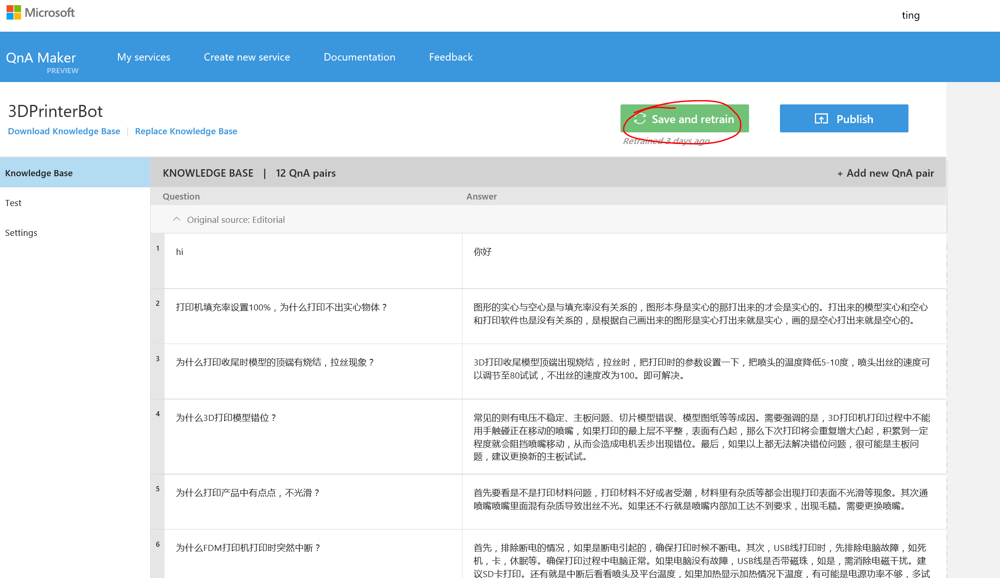
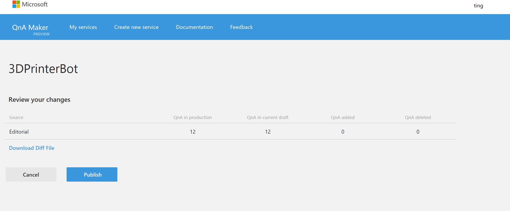
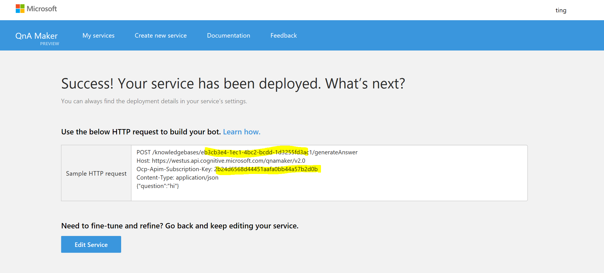
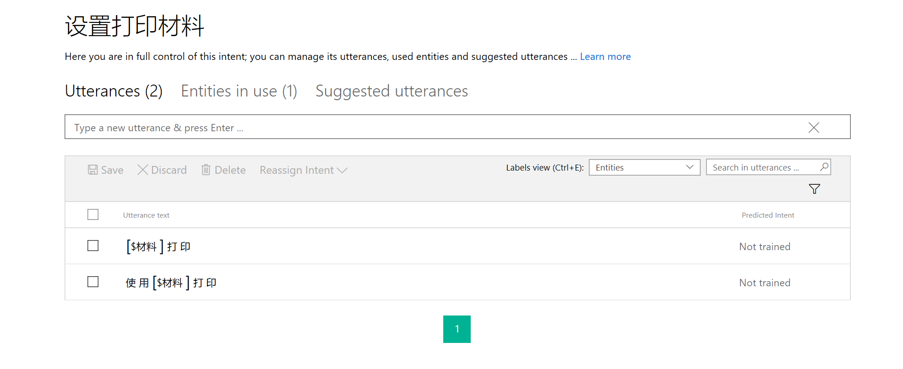
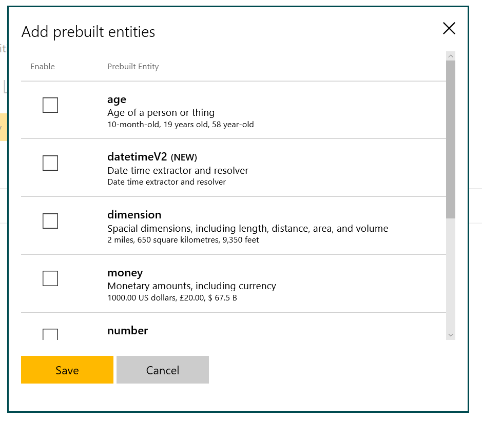
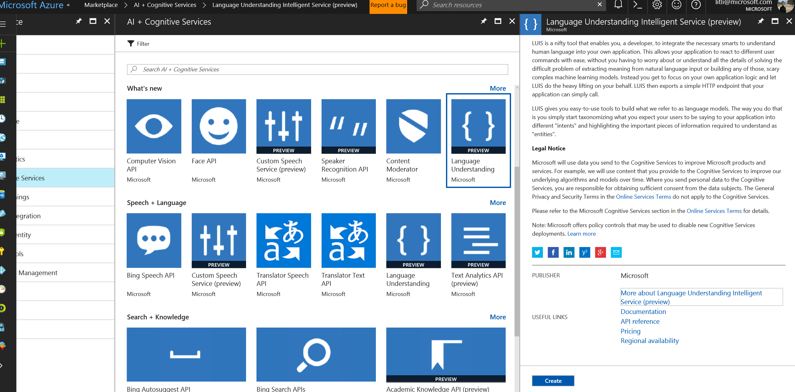
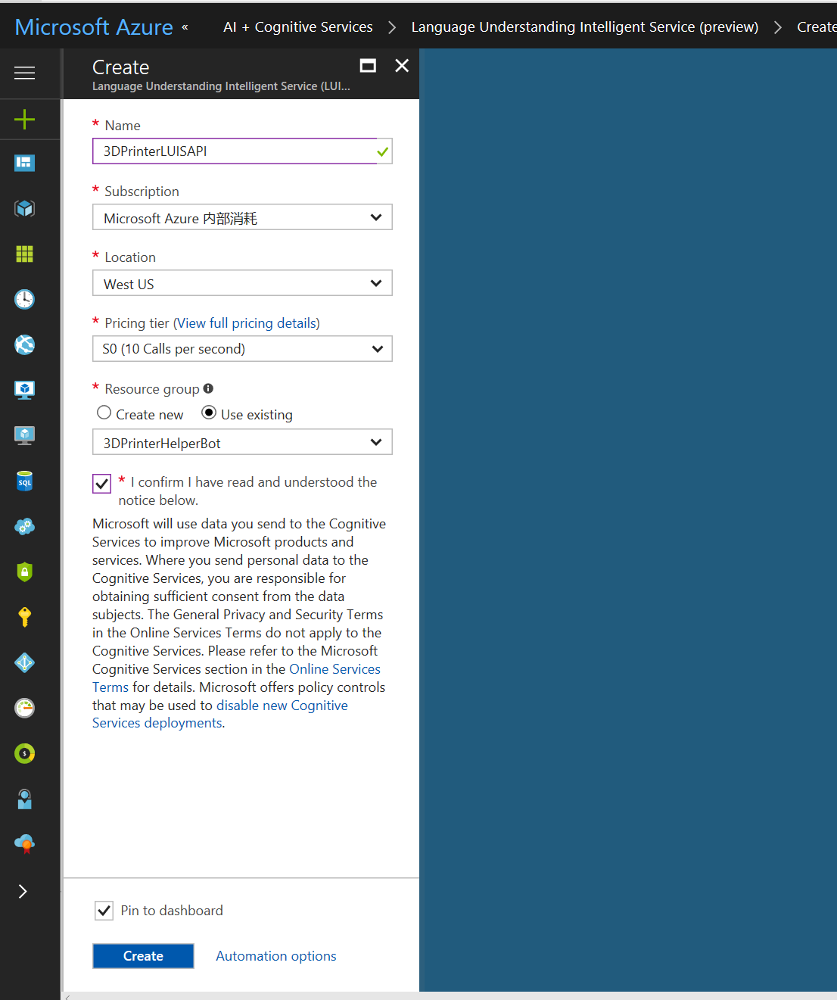
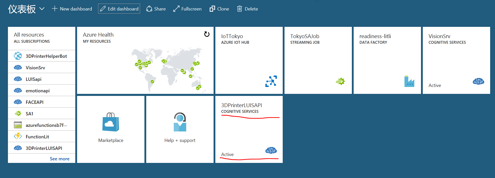
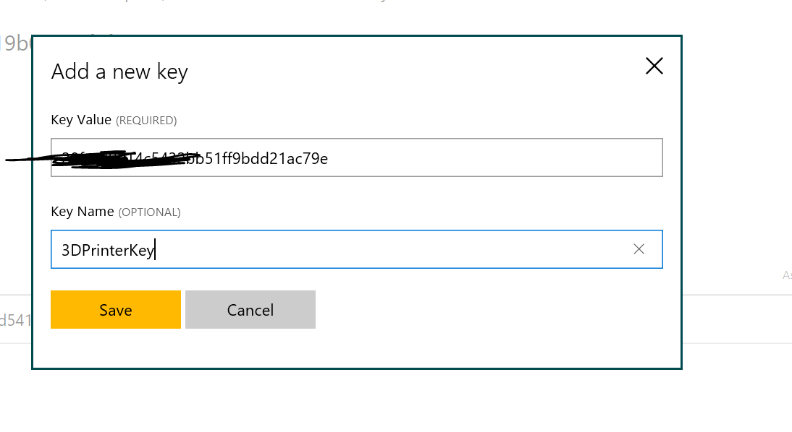

# 3DPrinterQnABot
3DPrinterQnABot将介绍如何使用[QnAMaker](htpp://qnamaker.ai)轻松创建一个问答帮助机器人的服务，并使用[Bot Framework](http://dev.botframework.com)集成该QnA服务实现一个可以在Skype/Web的机器人样例。本样例主要包括以下几部分内容：
- 创建QnA服务
- 创建3DPrinterQnABot
- 注册发布3DPrinterQnABot
- 测试3DPrinterQnABot

注： 该样例需要访问[QnAMaker](http://qnamaker.ai)和[Bot Framework](http://dev.botframework.com)，需要有Microsoft Account。

## 创建QnA服务 ##
QnAMaker可以让开发者使用FAQ URl，FAQ文件或者手工录入问题答案等方式，轻松构建一个问答机器人服务。访问[QnAMaker.ai](http://qnamaker.ai)，开始你的问答机器人的创建吧。
使用Microsoft Account登陆QnAMaker门户后，点击Create a new service，输入服务名称，和FAQ信息：FAQ URL， FAQ文件或者手工输入FAQ。这里我们选择使用FAQ 文件，如果使用FAQ文件，请注意必须是.tsv, .pdf, .doc, .docx文件，每个问答一行，中间用tab键空开（具体可以参考[FAQ Test](./FAQTest.tsv)，文件大小不能超过2M


QnA服务创建成后，就可以看到FAQ文件的问题被正确导入到QnA服务的Knowledge Base中， 此时也可以对问答信息再做编辑调整，如果没问题，就可以点击Save and Train，对Knowledge Base训练。


QnA服务训练完成后，就可以开始测试，点击test标签，进入测试页面， 可以输入之前FQA中相关问题，因为QnA后台是语义服务的支撑，因此这里不需要完全按照FQA中一样的问题提问，可以按照自然语言方式测试。


QnA服务测试通过后，就进入服务发布阶段，点击Publish，进入发布页面：


确认服务发布，服务即可发布，成功后可以看到成功信息，并显示QnA服务调用的Rest API调用信息。其中包括服务id和订阅id，见下图中标黄部分。这个是QnA服务调用的认证信息。


QnA服务发布成功，我们可以将该服务集成到BoT程序中，让它成为BoT的后台服务，提供问答服务。

## 创建3DPrinterQnABot ##
微软[BoT Framework](http://dev.botframework.com)为开发者提供BoT程序开发框架，可以使用Microsoft Account登陆BoT Framework官网，了解BoT应用开发相关内容。


其中 C# 开发者可以利用Visual Studio提供的Template创建BoT Application。Visual Studio Template下载安装，BoT应用创建可以访问[参考文档](https://docs.microsoft.com/en-us/bot-framework/dotnet/bot-builder-dotnet-quickstart)
再Visual Studio中安装BoT Template后，就可以创建BoT应用，输入BoT Solution名称等信息。


BOT应用创建成功后，就可以开始BoT开发工作了，在这里说明以下该样例再BoT Framework框架中增加代码。
1. Web.config中的appSettings描述里增加QnA服务ID和订阅ID信息。
```
  <appSettings>
    <!-- update these with your BotId, Microsoft App Id and your Microsoft App Password-->
    <add key="BotId" value="3DPrinterHelperBot" />
    <add key="MicrosoftAppId" value="9820668a-113a-477f-b0b5-5dfa9de4d6b8" />
    <add key="MicrosoftAppPassword" value="T59pNnmhqocaGfEgNg5aw71" />
    <add key="KnowledgeBaseId" value="eb3cb3e4-1ec1-4bc2-bcdd-1d3255fd3ac1"/>
    <add key="SubscriptionKey" value="2b24d6568d44451aafa0bb44a57b2d0b"/>
  </appSettings>
```


## 创建实例 ##
按照上面意图创建完成设置打印材料意图创建，并输入语料“使用树脂打印”，回车后，在语料文本中，使用鼠标双击你需要定义的实例文本，如这里是树脂。然后输入实例名称“材料”，点击创建实例按钮，即可完成实例创建。


需要为所有需要实例的语料创建或者配置指定的实例。


此外，LUIS模型中提供预定义的实例，如时间，数字，百分比，年龄等，当你需要的语料实例是预定义实例时，就不用创建这些实例类型，直接录入语料就可以自动识别这些实例。


## 训练与测试意图 ##
完成意图与语料的输入后，即可开始训练。点击训练与测试，进入训练界面，点击训练


训练完成后，可以输入测试的语料，测试意图训练的结果。例如输入“开机”，测试结果显示识别该语料的意图结果“启动打印机”，信心指数为0.95


可以持续的添加意图，语料之后再进行训练测试。
## 发布语义应用 ##
完成所有训练和测试，就可以发布语义应用，提供给需要使用本应用解析意图的应用使用了。 点击发布菜单，进入语义应用发布页面，正式发布应用就需要LUIS的访问密钥了。这里介绍使用Azure订阅在[Azure Portal](http://portal.azure.com)中创建LUIS服务并获得Key。
登陆[Azure Portal](http://portal.azure.com)后， 点击创建，选择AI+Cognitive Services，点击Language Understanding，然后点击Create。


输入LUIS服务名称等信息，选择计价模式，为了方便使用，可以选择将该服务钉在管理页面上。


创建完成，进入管理首页，就可以看到刚刚创建的LUIS服务3DPrinterLUISAPI，点击进入该服务，在服务信息列表中点击Key，进入密钥管理页面，选择拷贝Key1或者Key2. 注意创建新密钥需要最多10分钟的生效时间， 如果将密钥配置到语义应用时报错，可以稍等几分钟就生效了。 



获取密钥后， 进入LUIS语义应用发布页面， 选择添加密钥，输入密钥信息和名称，然后点击保存。


密钥添加成功，选择使用该密钥，然后就可以发布应用，点击发布。发布成功后，回生成应用访问的REST API 的Endpoint url，点击该URL可以进行测试。


在URL后面添加需要测试语料信息，如图
(./images/image23.PNG)

调用返回LUIS语义应用处理结果，如图
(./images/image24.PNG)

## 总结 ##
LUIS提供给开发者独立完成语义训练环境和服务，利用它可以作为BoT的意图处理中心，实现自己的人工智能服务。 